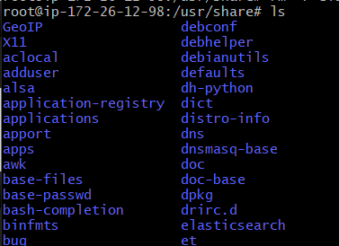

# Untitled


chmod 400 cert4.pem

ssh -i cert4.pem ubuntu@ip주소


sudo su \(관리자 권한\)


단 apt-get을 사용하여 최신 정보로 업데이트를 수행합니다.   
apt-get update

자바설치하기  
apt-get install default-jre

  sudo apt-get install openjdk-8-jre  

sudo apt-get install openjdk-8-jdk  


## JAVA\_HOME 환경변수 설정


위치


위치 확인

/usr/lib/jvm/java-8-openjdk-amd64/



```text
sudo nano /etc/profile
```





```text
export JAVA_HOME=/usr/lib/jvm/java-8-openjdk-amd64
export PATH=$JAVA_HOME/bin/:$PATH
export CLASS_PATH=$JAVA_HOME/lib:$CLASS_PATH

```



> 저장하기 ctrl+x  -&gt;  y  -&gt; enter



```text
source /etc/profile 
```





```text
sudo reboot now

```





```text
 echo $JAVA_HOME

```




## 실행.



```text
sudo service elasticsearch restart
sudo service elasticsearch start
sudo -i service elasticsearch start
sudo -i service elasticsearch stop
```



> 백그라운드에서 실행이 되는지 안보여서 curl로 실행해보았다.

```text
 curl GET '127.0.0.1:9200'
```





> /usr/share/elasticsearch\# sudo bin/elasticsearch-plugin install analysis-nori

```text
sudo bin/elasticsearch-plugin install analysis-nori
```


## 외부접속 열어주자!

> elasticsearch.yml 설정을 수정하자

파일은  /etc/elasticsearch에 위치하고있다.


> 재시작을 해주자

```text
sudo service elasticsearch restart
```


 \) **curl: \(7\) Failed to connect to HOST\_NAME port 9200: 연결이 거부됨** 발생 시,  
- `sudo ufw allow 9200` 명령어로 9200번 포트를 열어준다.


```text
wget https://artifacts.elastic.co/downloads/elasticsearch/elasticsearch-7.1.0-linux-x86_64.tar.gz
tar -xzf elasticsearch-7.1.0-linux-x86_64.tar.gz
cd elasticsearch-7.1.0/ 
```

